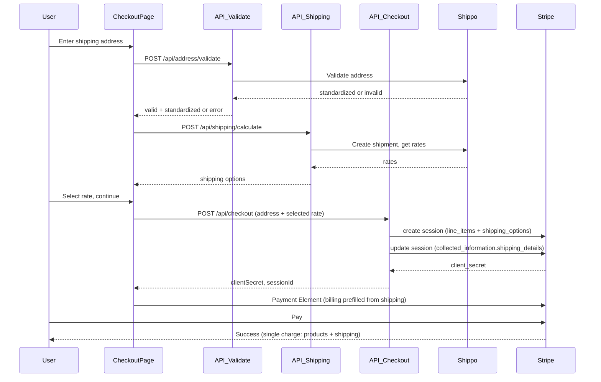

# Checkout, Shipping & Billing Flow

Summary of how shipping and billing are collected, validated, and charged with Stripe and Shippo.

## Flow (Shipping-First)

1. **Checkout page** collects shipping address (name, line1, line2, city, state, postal_code, country).
2. User clicks **Validate & get shipping** → `POST /api/address/validate` (Shippo Address Validation). Invalid or PO Box addresses are rejected; valid addresses return a standardized snapshot.
3. **Shipping rates** are fetched with `POST /api/shipping/calculate` (Shippo). User selects a method.
4. User continues to payment → `POST /api/checkout` with `shippingAddress`, `selectedShippingRate`, and optional `standardizedAddress`. A Stripe Checkout Session is created with one shipping option (the selected rate); the session is updated with `collected_information.shipping_details` and optional `metadata.shipping_address_standardized`.
5. **Stripe Payment Element** collects billing; billing is prefilled from shipping when available.
6. User pays once; **product + shipping** are charged together in a single Stripe payment.

## Legacy Path (Stripe-Collects Address)

If a session is created without preselected shipping (`shippingAddressCollection: true`), Stripe’s UI collects the address. The app’s `POST /api/checkout/shipping` is then used (e.g. via Stripe’s dynamic shipping flow):

1. **Shippo validation** runs on the address Stripe sends (same policy as shipping-first: validate, reject invalid/PO Box, use standardized address for rates and session update).
2. Shippo rates are calculated and the session is updated with `collected_information.shipping_details` and `shipping_options`.

Validation runs in both paths so US addresses are validated with Shippo when configured.

## Where Validation Runs

| Step              | Shipping-first                         | Legacy (Stripe-collected address)     |
|-------------------|----------------------------------------|--------------------------------------|
| Address validation| `POST /api/address/validate` (checkout page) | `POST /api/checkout/shipping` (server) |
| Shipping rates    | `POST /api/shipping/calculate`         | Inside `POST /api/checkout/shipping`  |
| Billing           | Stripe Payment Element (prefilled from shipping) | Stripe Payment Element              |

## Configuration

- **Stripe**: `NEXT_PUBLIC_STRIPE_PUBLISHABLE_KEY`, `STRIPE_SECRET_KEY`; optional `STRIPE_TAX_ENABLED`, `STRIPE_LOGO_URL`.
- **Shippo**: `SHIPPO_API_KEY`; origin address: `SHIPPO_ORIGIN_NAME`, `SHIPPO_ORIGIN_STREET1`, `SHIPPO_ORIGIN_CITY`, `SHIPPO_ORIGIN_STATE`, `SHIPPO_ORIGIN_ZIP`; optional `SHIPPO_ORIGIN_COUNTRY` (default US).
